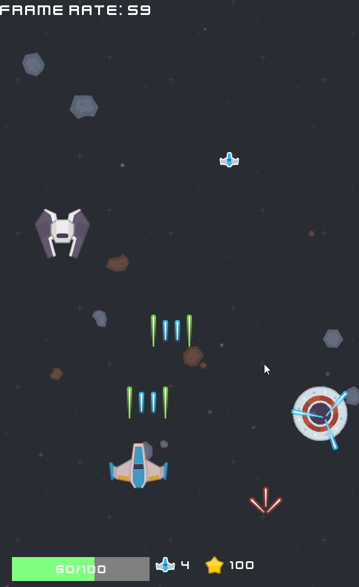

# Light Years Game
Welcome to the Light Years Game repository! This project is a space-themed adventure game. the game and the engine were developed using C++, CMake, and the Simple and Fast Multimedia Library (SFML).

# Learning Objectives
This project was developed to achieve the following learning objectives:

- C++ Proficiency: Enhance C++ programming skills by focusing on game development.
- SFML Integration: Utilize SFML for handling graphics, audio, and input.
- Design Patterns: Apply design patterns such as delegate callbacks, singletons, and others to ensure efficient and maintainable code.

<table>
  <tr>
    <td style="border: none;"></td>
    <td style="border: none; width: 15px;"></td>
    <td style="border: none;"></td>
  </tr>
</table>

This game was developed following the ideas of Jingtian Li's c++ course on udemy
